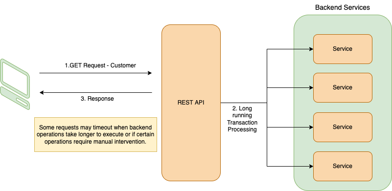

# Responsive Application Design for Long Running operations

Majority of the Web APIs are developed to perform simple CRUD operations. Most operations the API performs are blocking in nature, especially querying DB, communicating with other services over a messaging service. An incoming request is serviced by a thread, which performs among other things, security and authorization checks, input sanity checks, checking business rules and performing data transactions. The client expects these operations to complete within the scope of the request, and a response would indicate the success or failure of the operation.

Once in a while, we will be tasked with building functionality on the frontend, which contains calling an API to perform operations that can take more than a reasonable amount of time. The operation may not complete within the request timeout, and the API would then send a response to indicate the current status of the operation before closing the request. As a result, the frontend needs to implement a mechanism to query the current state of the operation to know when the operation completes. Or the users of the application need to resort to reloading the application's view to know the current status.



This design of an application not only adds load on the backend to respond to polling requests for querying status of the previous operation, but the frontend application needs to add polling mechanisms to its code.

It would be beneficial if we could design the frontend to be more responsive to backend events, using a push mechanism. This approach will open doors to building rich user experiences by keeping the user engaged with providing information that is kept fresh. Enabling push mechanisms will reduce churn on the backend to support fetching the current status of various business operations.

In this article we are going to explore the use of WebSockets to enable real-time updates reaching the frontend, to deliver the latest status of transactions.

Before we look at a reference implementation, lets get familiar with the technology we are going to use to build a sample application.

# Introduction to Vert.x

Vert.x is a toolkit used for creating reactive, non-blocking, and asynchronous applications that run on Java Virtual Machine. (JVM). It contains several components that help you create reactive applications. It is designed to be cloud-native.

Since Vert.x supports asynchronous applications it can be used to create applications with high volume of messages, large event processing, HTTP interactions, and so on.


The Vert.x core APIs contain the backbone for writing Vert.x applications and low-level support for HTTP, TCP, UDP, file system, asynchronous streams and many other building blocks. It is also used by many other components of Vert.x.

## WARNING

Vert.x APIs are non blocking and won’t block the event loop, but that’s not much help if you block the event loop yourself in a handler.

If you do that, then that event loop will not be able to do anything else while it’s blocked. If you block all of the event loops in Vertx instance then your application will grind to a complete halt!

Examples of blocking include:

<ol type="A">
<li>Thread.sleep()</li>
<li>Waiting on a lock</li>
<li>Waiting on a mutex or monitor (e.g. synchronized section)</li>
<li>Doing a long lived database operation and waiting for a result</li>
<li>Doing a complex calculation that takes some significant time.</li>
<li>Spinning in a loop</li>
</ol>

# About WebSockets

WebSocket is a communications protocol, providing full-duplex communication channels over a single TCP connection. The current API specification allowing web applications to use this protocol is known as WebSockets.

WebSocket is distinct from HTTP. Both protocols are located at layer 7 in the OSI model and depend on TCP at layer 4. Although they are different, RFC 6455 states that WebSocket "is designed to work over HTTP ports 443 and 80 as well as to support HTTP proxies and intermediaries", thus making it compatible with HTTP. To achieve compatibility, the WebSocket handshake uses the HTTP Upgrade header to change from the HTTP protocol to the WebSocket protocol.


The WebSocket protocol enables interaction between a web browser (or other client application) and a web server with lower overhead than half-duplex alternatives such as HTTP polling, facilitating real-time data transfer from and to the server.

Additionally, WebSocket enables streams of messages on top of TCP.

## Sample Application

To demonstrate the power of Vert.x and the flexibility that WebSockets bring, we are going to put together a very simple web application written on the JVM using Vert.x HTTP Server. Below diagram will depict how our sample application will look like:


## Building Verticles

Verticles are chunks of code that get deployed and run by Vert.x. A Vert.x instance maintains N event loop threads (where N by default is core*2) by default. Verticles can be written in any of the languages that Vert.x supports and a single application can include verticles written in multiple languages.

Here’s an example verticle:

```java
public class MyVerticle extends AbstractVerticle {

 // Called when verticle is deployed
 public void start() {
 }

 // Optional - called when verticle is undeployed
 public void stop() {
 }

}
```

Lets go through the steps in creating a HTTP Server to process incoming requests for both REST and WebSockets. We will start with defining a HTTP Router object to process incoming REST requests.

```java
    // Create a router object.
    m_router = Router.router(vertx);
    // A simple transaction endpoint
    m_router.get("/api/transaction/:customer/:tid").handler(this::handleTransaction);
    // A handler to serve static content like HTML and JS files
    m_router.route("/static/*").handler(StaticHandler.create());
    ....
    ....
    // Create the HTTP server
    vertx.createHttpServer()
        .requestHandler(m_router)
        .listen(
                // Retrieve the port from the
                // configuration, default to 8080.
                port,
                result -> {
                    if (result.succeeded()) {
                        m_logger.info("Listening now on port {}", port);
                        // Initialize application
                    } else {
                        m_logger.error("Failed to listen", result.cause());
                    }
                }
        );
```

Now that we defined a basic HTTP Server to process incoming HTTP requests, we are going to add a handler to process incoming WebSocket requests. In order to make the creation and use of WebSockets more easier on the client, we are going to use a popular WebSockets based JS library called SockJS.

## What is SockJS?

SockJS is a JavaScript library (for browsers) that provides a WebSocket-like object. SockJS gives you a coherent, cross-browser, Javascript API which creates a low latency, full duplex, cross-domain communication channel between the browser and the web server, with WebSockets or without.

Lets define out SockJS handler to process incoming WebSocket requests:

```java
    // Create the SockJS handler. Specify options.
    SockJSHandlerOptions options = new SockJSHandlerOptions()
            .setHeartbeatInterval(2000)
            .setRegisterWriteHandler(true); // We need an identifier
    SockJSHandler ebHandler = SockJSHandler.create(vertx, options);

    // Our websocket endpoint: /eventbus/
    m_router.route("/eventbus/*").subRouter(ebHandler.socketHandler(sockJSSocket -> {
        // Extract the identifier
        final String id = sockJSSocket.writeHandlerID();
        // Create an object to map the client socket
        ClientConnection connection = new ClientConnection(id, sockJSSocket, vertx.eventBus());
        // Keep track of open connections
        m_client_connections.put(id, connection);
        // Register for end callback
        sockJSSocket.endHandler((Void) -> {
            connection.stop();
            m_client_connections.remove(id);
        });
        // Start the connection
        connection.start();
    }));
```

We will now implement our REST endpoint handler. In order to keep our application non-blocking, we are going to employ a worker verticle to process the request, outside of the main event loop. The request will be forwarded to the worker using a message on the EventBus.

```java
    private void handleTransaction(RoutingContext rc) {
        // Capture the request and response objects
        HttpServerResponse response = rc.response();
        // Extract params
        String customer = rc.pathParam("customer");
        String tid = rc.pathParam("tid");

        // Build a message to send to the worker
        JsonObject requestObject = new JsonObject();
        requestObject.put("tid", tid);
        requestObject.put("customer", customer);
        requestObject.put("status", TransactionStatus.PENDING.value());
        
        // Send the message to the worker over the event bus
        // Specify a handler to process the response coming back from the worker
        vertx.eventBus().request("WORKER", requestObject.encode(), result -> {
            if (result.succeeded()) {
                String resp = result.result().body().toString();
                // If the response is prematurely closed
                if (response.closed() || response.ended()) {
                    return;
                }
                // Send the response to the client
                response
                        .setStatusCode(201)
                        .putHeader("content-type",
                                "application/json; charset=utf-8")
                        .end(resp);
            } else {
                if (response.closed() || response.ended()) {
                    return;
                }
                response
                        .setStatusCode(404)
                        .putHeader("content-type",
                                "application/json; charset=utf-8")
                        .end();
            }
        });

    }
```

Now that we have our main verticle defined, with a HTTP Server and handlers for endpoints, we will now move forward to define our worker verticle to process the requests.

We are going to define a simple worker which generates transaction updates on a timer with different states. Each state transition will be advertised over the event bus for listeners to receive and process the update as necessary.

```java
    public class ApiWorkerVerticle extends AbstractVerticle {
        ...
        @Override
        public void start() throws Exception {
            ...
            // get the application config
            ConfigRetriever retriever = ConfigRetriever.create(vertx,
                    new ConfigRetrieverOptions().addStore(fileStore));
            retriever.getConfig(
                    config -> {
                        // Initialize once we have the config
                        startup(config.result());
                    }
            );
        }

        private void startup(JsonObject config) {
            // Process app config
            processConfig(config);
            // Create our event bus listener.
            // We will receive all requests sent from the main verticle
            // by this consumer's handler
            worker_consumer = vertx.eventBus().consumer("WORKER");
            worker_consumer.handler(m -> {
                handleRequest(m);
            });
        }

        @Override
        public void stop() throws Exception {
            ...
        }
    }
```

We have our worker verticle defined with an event bus listener. The listener will receive all requests sent from the ApiVerticle. The handler will process each request as they are received.

```java
    private void handleRequest(Message<String> m) {
        // Extract the payload from the message
        JsonObject requestObject = new JsonObject(m.body());
        final String tid = requestObject.getString("tid");
        activeTransactions.put(tid, requestObject);
        // Prepare and respond to the request, before we process the request.
        requestObject.put("status", TransactionStatus.PENDING.value());
        requestObject.put("type", "transaction-status");
        m.reply(requestObject.encode());
        // process the transaction
        handleTransaction(tid);
    }
```

Out transaction processing is quite simple. We are going to employ a timer to generate timely updates with different states for a transaction.

```java
    private void handleTransaction(final String tid) {
        // Set a timer for 5 seconds
        vertx.setTimer(5000, x -> {
            updateTransaction(tid);
        });
    }

    // Various states for a transaction
    public enum TransactionStatus {
        PENDING("PENDING"),
        INITIATED("INITIATED"),
        RUNNING("RUNNING"),
        FINALIZING("FINALIZING"),
        COMPLETE("COMPLETE");
        ...
    }
```

Every time the timer fires, we are going to update the transaction's state, and publish the update over the event bus. Once we reach the final state, we will remove the active transaction from tracking.

```java
    private void updateTransaction(final String tid) {
        // Get the transaction
        JsonObject requestObject = activeTransactions.get(tid);
        if (requestObject != null) {
            TransactionStatus status = TransactionStatus.valueOf(requestObject.getString("status"));
            if (status.ordinal() < TransactionStatus.COMPLETE.ordinal()) {
                TransactionStatus nextStatus = TransactionStatus.values()[status.ordinal() + 1];
                // Prepare the update message
                requestObject.put("status", nextStatus.value());
                requestObject.put("type", "transaction-status");
                // Save before we send
                activeTransactions.put(tid, requestObject);
                // PUBLISH the update over the event bus
                publishTransaction(requestObject);
                if (nextStatus.ordinal() < TransactionStatus.COMPLETE.ordinal()) {
                    // If we are not in the terminal state
                    // schedule the next update
                    handleTransaction(tid);
                } else {
                    // If we reached a terminal state
                    // remove the transaction
                    activeTransactions.remove(tid);
                }
            }
        }
    }

    private void publishTransaction(final JsonObject obj) {
        // PUBLISH the message over the CUSTOMER topic
        // Only listeners interested in this CUSTOMER's events
        // will receive this message
        vertx.eventBus().publisher(obj.getString("customer")).write(obj.encode());
    }
```

We now have the necessary components in place the handle an incoming transaction request, process it in a worker, and publish the updates over an event bus. We now need to create a representation for a client interested in knowing these updates. We are going to define a connection object to represent a client's persistent connection over a WebSocket. This connection object will create the listener for the CUSTOMER topic over the event bus, and will funnel all events received, to the client over the WebSocket.

```java
    public class ClientConnection {
        public ClientConnection(final String writeHandlerID,
                                final SockJSSocket socket,
                                final EventBus eventBus)
        {
            // Save the socket and the socket identifier
            this.id = writeHandlerID;
            this.socket = socket;
            // We will use the event bus to listen to updates
            // published by the worker verticle for a CUSTOMER
            this.eventBus = eventBus;
        }

        // Attach a handler to process messages received from the client
        public void start() {
            socket.handler(
                buffer -> {
                    String message = buffer.toString();
                    handleMessage(message);
                }
            );
        }
    }
```

Since we do not want to have a persistent WebSocket connection at all times, we are going to create it and use it only for the time-span of the transaction request.

```java
    private void handleMessage(final String messageStr) {
        JsonObject messageObj = new JsonObject(messageStr);
        String messageType = messageObj.getString("type");
        // When the client sends a "listen" request
        // we will setup the listener
        if (messageType.equalsIgnoreCase("listen")) {
            setupListener(messageObj.getString("customer"));
        }
    }

    private void setupListener(final String customer) {
        // Create the event bus consumer for the CUSTOMER topic
        if (consumer == null) {
            consumer = eventBus.consumer(customer);
            consumer.handler(event -> {
                // Funnel the incoming event bus message to the client
                socket.write(event.body());
            });
        }
        // Send the ACK for the listen request
        JsonObject obj = new JsonObject();
        obj.put("type", "listen-ack");
        obj.put("customer", customer);
        sendMessage(obj.encode());
    }

    private void sendMessage(final String message) {
        socket.write(message);
    }
```

We now have a working API to handle both incoming HTTP and WebSocket requests. Lets now create the client with the ability to make HTTP requests as well as open a WebSocket connection for the duration of the transaction processing.

```javascript
            // Define the socket object
            var socket = null;

            function openSocket() {
                // Open a socket
                socket = new SockJS("/eventbus/");
                socket.onopen = function () {
                    listen();
                };
                // Define a handler to process incoming message
                socket.onmessage = function(msg) {
                    processMessage(msg.data);
                };
                ...
            }

            function closeSocket() {
                socket.close();
                socket = null;
            }

            function submitTransaction() {
                // Open socket right before we submit a transaction
                // Once the socket is opened we will make the HTTP REST call
                openSocket();
            }

            // Send a request to listen for updates
            function listen() {
                var message = {};
                message.type = "listen";
                message.customer = document.getElementById("customer-value").value;
                sendMessage(JSON.stringify(message));
            }

            function sendMessage(msg) {
                socket.send(msg);
            }

            function processMessage(msg) {
                var obj = JSON.parse(msg);
                if (obj.type === 'listen-ack') {
                    handleListenAck(obj);
                } else if (obj.type === 'transaction-status') {
                    handleTransactionStatus(obj);
                }
            }

            function handleListenAck(obj) {
                // Make API call
                sendTransaction();
            }

            function handleTransactionStatus(obj) {
                if (obj.status === 'COMPLETE') {
                    closeSocket();
                }
            }

            // REST request
            function sendTransaction() {
                var cid = document.getElementById("customer-value").value;
                var tid = document.getElementById("transaction-value").value;
                let xmlHttpReq = new XMLHttpRequest();
                xmlHttpReq.onreadystatechange = function () {
                    if (xmlHttpReq.readyState === 4 && (xmlHttpReq.status === 200 || xmlHttpReq.status === 201))
                        display("REST RCV: " + xmlHttpReq.responseText);
                }
                xmlHttpReq.open("GET", "http://localhost:8080/api/transaction/" + cid + "/" + tid, true); // true for asynchronous
                xmlHttpReq.send(null);
            }
```

We now have a JS frontend that can make a transaction request over HTTP, and listen to transaction updates over a WebSocket for the duration of the transaction processing.
